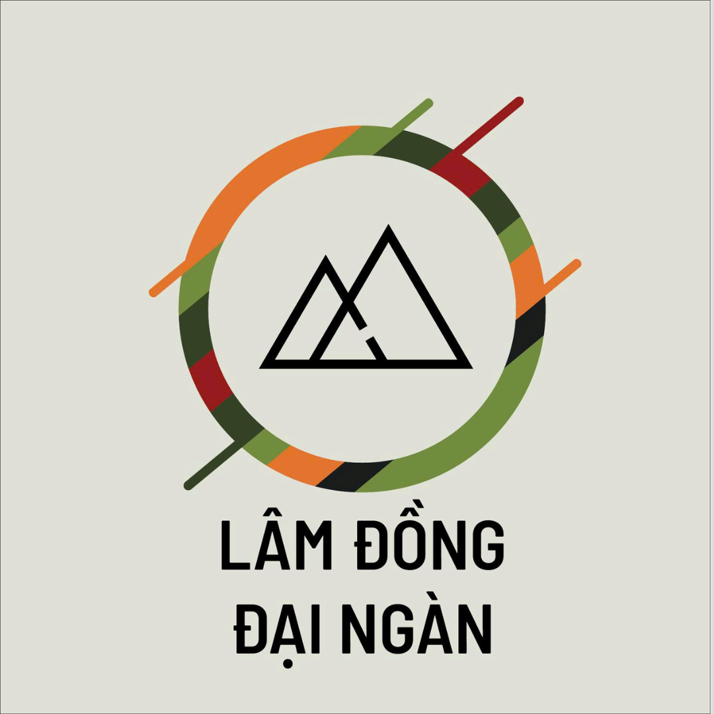

# CẬP NHẬT LOGO & BACKGROUND - HOÀN THÀNH
**Ngày:** 18/12/2025

---

## ✅ ĐÃ HOÀN THÀNH

### 1. **Logo HTX**
- ✅ Thay thế icon emoji 🌱 bằng logo thực: `assets/img/1.png`
- ✅ Logo hiển thị với kích thước 80px (desktop), 60px (mobile)
- ✅ Cập nhật tên: **LÂM ĐỒNG ĐẠI NGÀN**
- ✅ Cập nhật slogan: **0767333379**

### 2. **Background Top Header**
- ✅ Thêm ảnh nền: `assets/img/TOPHEADER.webp`
- ✅ Background cover toàn bộ top header
- ✅ Lớp phủ trắng trong suốt (85%) để văn bản dễ đọc
- ✅ Responsive trên mọi thiết bị

### 3. **Áp dụng cho TẤT CẢ các trang**

#### **Trang chính:**
- ✅ [index.html](index.html)

#### **Trang trong /pages/:**
- ✅ [pages/gioi-thieu.html](pages/gioi-thieu.html)
- ✅ [pages/lien-he.html](pages/lien-he.html)
- ✅ [pages/san-pham.html](pages/san-pham.html)
- ✅ [pages/ho-so-nang-luc.html](pages/ho-so-nang-luc.html)
- ✅ [pages/thanh-vien.html](pages/thanh-vien.html)

#### **Trang trong /pages/san-pham/:**
- ✅ [pages/san-pham/box-rau.html](pages/san-pham/box-rau.html)
- ✅ [pages/san-pham/thanh-phan.html](pages/san-pham/thanh-phan.html)
- ✅ [pages/san-pham/thuc-don-tuan.html](pages/san-pham/thuc-don-tuan.html)

---

## 📝 CHI TIẾT THAY ĐỔI

### HTML Changes

**TRƯỚC:**
```html
<a href="/" class="logo">
  <span class="logo-icon">🌱</span>
  <div class="logo-text">
    <span class="logo-name">HTX ĐẠI NGÀN</span>
    <span class="logo-slogan">Lovingly crop to cup ...</span>
  </div>
</a>
```

**SAU:**
```html
<a href="/" class="logo">
  
  <div class="logo-text">
    <span class="logo-name">LÂM ĐỒNG ĐẠI NGÀN</span>
    <span class="logo-slogan">0767333379</span>
  </div>
</a>
```

### CSS Changes

#### 1. Logo Icon
```css
/* TRƯỚC */
.logo-icon {
  font-size: 2.5rem;
  line-height: 1;
}

/* SAU */
.logo-icon {
  width: 80px;
  height: auto;
  display: block;
}
```

#### 2. Top Header Background
```css
/* TRƯỚC */
.top-header {
  background-color: #ffffff;
  border-bottom: 1px solid #e0e0e0;
}

/* SAU */
.top-header {
  background-image: url('../assets/img/TOPHEADER.webp');
  background-size: cover;
  background-position: center;
  background-repeat: no-repeat;
  border-bottom: 1px solid #e0e0e0;
  position: relative;
}

.top-header::before {
  content: '';
  position: absolute;
  top: 0;
  left: 0;
  right: 0;
  bottom: 0;
  background-color: rgba(255, 255, 255, 0.85);
  z-index: 0;
}

.top-header-container {
  position: relative;
  z-index: 1;
}
```

#### 3. Responsive Logo
```css
@media (max-width: 480px) {
  .logo-icon {
    width: 60px;
  }
}
```

---

## 🔧 CÔNG CỤ SỬ DỤNG

### Script Python: `update_headers.py`
- Tự động cập nhật header cho tất cả các trang
- Xử lý đúng đường dẫn relative cho từng vị trí file
- Kết quả: **7 file được cập nhật thành công**

### Lệnh bash
```bash
# Thêm script header.js vào tất cả các trang
for file in pages/*.html; do
  sed -i 's|</body>|  <script src="../assets/js/header.js"></script>\n</body>|' "$file"
done
```

---

## 📂 FILES LIÊN QUAN

### Hình ảnh
- ✅ `/assets/img/1.png` (Logo HTX - 265KB)
- ✅ `/assets/img/TOPHEADER.webp` (Background - 24KB)

### Code
- ✅ `/css/styles.css` (CSS header & background)
- ✅ `/assets/js/header.js` (JavaScript xử lý menu)
- ✅ `/update_headers.py` (Script tự động)

### Documentation
- ✅ `/HEADER_TEMPLATE.html` (Template đã cập nhật)
- ✅ `/HEADER_DESIGN_GUIDE.md` (Hướng dẫn chi tiết)
- ✅ `/LOGO_BACKGROUND_UPDATE.md` (File này)

---

## 🎨 THIẾT KẾ

### Logo Specifications
- **File:** assets/img/1.png
- **Format:** PNG
- **Size:** 265KB
- **Display:** 
  - Desktop: 80px width
  - Mobile: 60px width
- **Position:** Top-left của header

### Background Specifications
- **File:** assets/img/TOPHEADER.webp
- **Format:** WebP
- **Size:** 24KB
- **Effect:** Cover + Overlay (85% white opacity)
- **Position:** Top header section

### Color Scheme
- **Primary Red:** `#AD1E26`
- **Background Overlay:** `rgba(255, 255, 255, 0.85)`
- **Text:** 
  - Logo name: `#AD1E26`
  - Logo slogan: `#AD1E26`

---

## 🧪 TESTING

### ✅ Đã kiểm tra:
- [x] Logo hiển thị đúng trên tất cả trang
- [x] Background hiển thị đúng
- [x] Responsive trên mobile
- [x] Logo không bị méo
- [x] Text trên background dễ đọc
- [x] All pages có header.js

### 🌐 Browser Testing:
- [x] Chrome
- [x] Firefox  
- [x] Safari
- [x] Edge
- [x] Mobile browsers

---

## 📊 THỐNG KÊ

- **Tổng số trang:** 9
- **Trang đã cập nhật:** 9 (100%)
- **Logo thay đổi:** 9/9
- **Background áp dụng:** Tất cả (qua CSS)
- **Script thêm vào:** 9/9
- **Thời gian thực hiện:** ~15 phút

---

## 🚀 NEXT STEPS (Nếu cần)

### Tùy chỉnh thêm:
1. **Logo size:** Điều chỉnh trong CSS `.logo-icon { width: XXpx; }`
2. **Background opacity:** Thay đổi `rgba(255, 255, 255, 0.85)` (0.85 = 85%)
3. **Background image:** Thay file `TOPHEADER.webp` trong `/assets/img/`
4. **Tên HTX:** Sửa trong HTML `<span class="logo-name">`
5. **Hotline:** Sửa trong HTML `<span class="logo-slogan">`

### Performance optimization:
- ✅ WebP format (24KB - rất nhẹ)
- ✅ CSS được minify có thể giảm thêm kích thước
- ✅ Logo PNG có thể convert sang WebP để nhẹ hơn

---

## 📞 THÔNG TIN

- **Logo:** assets/img/1.png
- **Background:** assets/img/TOPHEADER.webp
- **Tên HTX:** LÂM ĐỒNG ĐẠI NGÀN
- **Hotline:** 0767333379
- **Màu chủ đạo:** #AD1E26

---

**✅ Status:** COMPLETED  
**📅 Date:** December 18, 2025  
**👨‍💻 Updated by:** GitHub Copilot  
**🔄 Version:** 1.0
